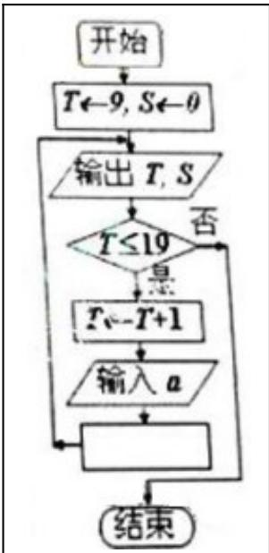

> [!faq]- 2010年上海高考数学真题（文科）试卷（word解析版）解析
>
> > [!success]- **【答案】** 详见解析
>
> > [!note]- **【分析】**
> > 本题未单列分析。
>
> > [!note]- **【解析】**
> > 考查反函数相关概念、性质
> >
> > 法一：函数 $f(x)=\log_{3}(x+3)$ 的反函数为 $y=3^{x}-3$ ，另 x=0，有 y=-2
> >
> > 法二：函数 $f(x)=\log_{3}(x+3)$ 图像与 x 轴交点为 $(-2,0)$ ，利用对称性可知，函数 $f(x)=\log_{3}(x+3)$ 的反函数的图像与 y 轴的交点为 $(0,-2)$
> >
> > 
