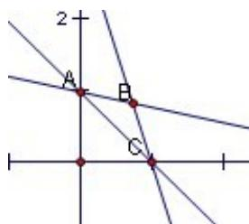

> [!faq]- 2010年上海高考数学真题（文科）试卷（word解析版）解析
>
> > [!success]- **【答案】** 详见解析
>
> > [!note]- **【分析】**
> > 本题未单列分析。
>
> > [!note]- **【解析】**
> > $\mathrm{B}\left(\frac{n}{n+1},\frac{n}{n+1}\right)$ 所以 BO⊥AC,
> >
> > $$
> > S _ {n} = \frac {1}{2} \times \sqrt {2} \times \left(\frac {n}{n + 1} \sqrt {2} - \frac {\sqrt {2}}{2}\right) = \frac {n - 1}{2 (n + 1)}
> > $$
> >
> > 
> >
> > 所以 $\lim_{n\to \infty}S_n = \frac{1}{2}$
> >
> > ##
> > 二. 选择题（本大题满分20分）本大题共有4题，每题有且只有一个正确答案。考生必须在答题纸的相应编号上，将代表答案的小方格涂黑，选对得5分，否则一律得零分。
