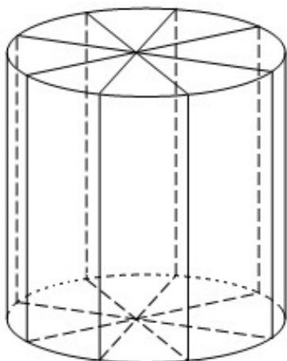

<!-- question-source:start -->
(2) 若要制作一个如图放置的、底面半径为 0.3 米的灯笼，请作出用于制作灯笼的三视图（作图时，不需考虑骨架等因素）.

<!-- question-source:end -->

![[高中/真题/按年份分类/2010/2010年上海高考数学真题_文科_试卷_word解析版_/选择题/题目/answers/Q00027900A1.md]]
