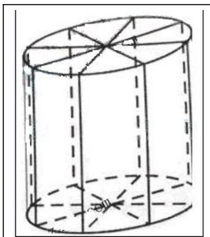

> [!faq]- 2010年上海高考数学真题（文科）试卷（word解析版）解析
>
> > [!success]- **【答案】** 详见解析
>
> > [!note]- **【分析】**
> > 本题未单列分析。
>
> > [!note]- **【解析】**
> > (1) 设圆柱形灯笼的母线长为 $l$ ，则
> >
> > 
> >
> > $$
> > l = 1. 2 - 2 r (0 <   r <   0. 6), S = - 3 \pi (r - 0. 4) ^ {2} + 0. 4 8 \pi ,
> > $$
> >
> > 所以当 r=0.4 时，S 取得最大值约为 1.51 平方米；
> > (2) 当 $r = 0.3$ 时, $l = 0.6$ , 作三视图略.
