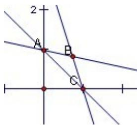

<!-- question-source:start -->
11. 将直线 $l_{2}: nx + y - n = 0$ 、 $l_{3}: x + ny - n = 0$ （ $n \in N^{*}, n \geq 2$ ）×
轴、y轴围成的封闭图形的面积记为 $S_{n}$ ，则 $\lim_{n\to\infty}S_n=$ \_\_\_\_。

<!-- question-source:end -->

![[高中/真题/按年份分类/2010/2010年上海高考数学真题_理科_试卷_word解析版_/填空题/题目/answers/Q00025896A1.md]]
