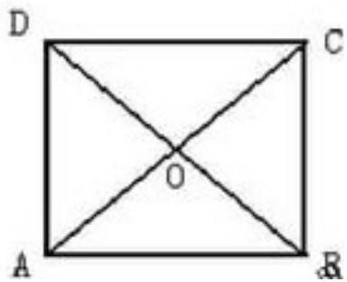

<!-- question-source:start -->
13. 

13。如图所示，直线 x=2 与双曲线 $\Gamma:\frac{\lambda^{2}}{4}-y^{2}=1$ 的渐近线交于 $E_{1},E_{2}$ 两点，记 $OE_{1}=e_{1},OE_{2}=e_{2}$ ，任取双曲线 $\Gamma$ 上的点 P，若 $OP=ae_{1},+be_{2}(a\setminus b\in R)$ ，则 a、b 满足的一个等式是
<!-- question-source:end -->

![[高中/真题/按年份分类/2010/2010年上海高考数学真题_理科_试卷_word解析版_/填空题/题目/answers/Q00027920A1.md]]
