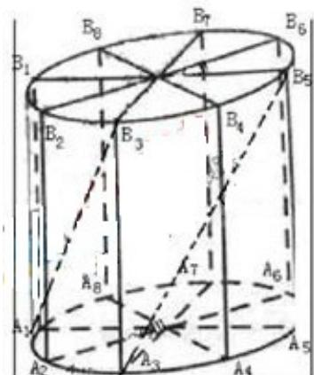

<!-- question-source:start -->
## 21、（本大题满分 13 分）本题共有 2 个小题，第 1 小题满分 5 分，第 2 小题满分 8 分.

如图所示, 为了制作一个圆柱形灯笼, 先要制作 4 个全等的矩形骨架, 总计耗用 9.6 米铁丝, 骨架把圆柱底面 8 等份, 再用 S 平方米塑料片制成圆柱的侧面和下底面（不安装上底面）.

(1)当圆柱底面半径 $r$ 取何值时， $S$ 取得最大值？并求出该

最大值（结果精确到 0.01 平方米）；

(2) 在灯笼内, 以矩形骨架的顶点为点, 安装一些霓虹灯, 当灯

笼的底面半径为 0.3 米时，求图中两根直线 $A_{1}B_{3}$ 与 $A_{3}B_{5}$ 所在

异面直线所成角的大小（结果用反三角函数表示）

<!-- question-source:end -->

![[高中/真题/按年份分类/2010/2010年上海高考数学真题_理科_试卷_word解析版_/解答题/题目/answers/Q00029520A1.md]]
