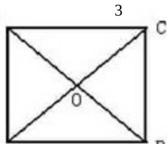

> [!faq]- 2010年上海高考数学真题（理科）试卷（word解析版）解析
>
> > [!success]- **【答案】** 详见解析
>
> > [!note]- **【分析】**
> > 本题未单列分析。
>
> > [!note]- **【解析】**
> > 翻折后的几何体为底面边长为4，侧棱长为 $2\sqrt{2}$ 的正三棱锥，
> > 高为 $\frac{2\sqrt{6}}{3}$ 所以该四面体的体积为 $\frac{1}{3}\times\frac{1}{2}\times16\times\frac{\sqrt{3}}{2}\times\frac{2\sqrt{6}}{3}=\frac{8\sqrt{2}}{3}$
> >
> > 
> >
> > 13。如图所示，直线 x=2 与双曲线 $\Gamma:\frac{\lambda^{2}}{4}-y^{2}=1$ 的渐近线交于 $E_{1}, E_{2}$ 两点，记 $OE_{1}=e_{1}, OE_{2}=e_{2}$ ，任取双曲线 $\Gamma$ 上的点 P，若 $OP=ae_{1}, +be_{2}(a, b \in R)$ ，则 a、b 满足的一个等式是 4ab=1
