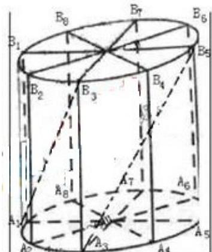

> [!faq]- 2010年上海高考数学真题（理科）试卷（word解析版）解析
>
> > [!success]- **【答案】** 详见解析
>
> > [!note]- **【分析】**
> > 本题未单列分析。
>
> > [!note]- **【解析】**
> > (1) 当 n=1 时， $a_{1}=-14$ ；当 $n\geq2$ 时， $a_{n}=S_{n}-S_{n-1}=-5a_{n}+5a_{n-1}+1$ ，所以 $a_{n}-1=\frac{5}{6}(a_{n-1}-1)$ ，又 $a_{1}-1=-15\neq0$ ，所以数列 $\{a_{n}-1\}$ 是等比数列；
> >
> > (2) 由(1)知： $a_{n}-1=-15\cdot\left(\frac{5}{6}\right)^{n-1}$ ，得 $a_{n}=1-15\cdot\left(\frac{5}{6}\right)^{n-1}$ ，从而 $S_{n}=75\cdot\left(\frac{5}{6}\right)^{n-1}+n-90$
> >
> > $(n\in\mathbf{N}^{*});$
> >
> > 解不等式 $S_{n} < S_{n + 1}$ ，得 $\left(\frac{5}{6}\right)^{n - 1} < \frac{2}{5}, n > \log_{\frac{5}{6}}\frac{2}{25} + 1 \approx 14.9$ ，当 $n \geq 15$ 时，数列 $\{S_n\}$ 单调递增；
> >
> > 同理可得，当 $n \leq 15$ 时，数列 $\{S_n\}$ 单调递减；故当 $n = 15$ 时， $S_n$ 取得最小值.
> >
> > ## 21、（本大题满分 13 分）本题共有 2 个小题，第 1 小题满分 5 分，第 2 小题满分 8 分.
> >
> > 如图所示, 为了制作一个圆柱形灯笼, 先要制作 4 个全等的矩形骨架, 总计耗用 9.6 米铁丝, 骨架把圆柱底面 8 等份, 再用 S 平方米塑料片制成圆柱的侧面和下底面 (不安装上底面).
> >
> > (1)当圆柱底面半径 $r$ 取何值时， $S$ 取得最大值？并求出该
> >
> > 最大值（结果精确到 0.01 平方米）；
> >
> > (2) 在灯笼内, 以矩形骨架的顶点为点, 安装一些霓虹灯, 当灯
> >
> > 笼的底面半径为0.3米时，求图中两根直线 $A_{1}B_{3}$ 与 $A_{3}B_{5}$ 所在
> >
> > 异面直线所成角的大小（结果用反三角函数表示）
> >
> > 
