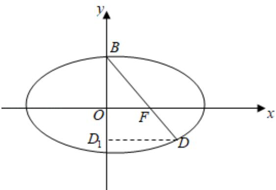

> [!faq]- 2010年全国统一高考数学试卷（文科）（大纲版ⅰ）（含解析版）解析
>
> > [!success]- **【答案】** $\frac{\sqrt{3}}{3}$
>
> > [!note]- **【分析】**
> > 由椭圆的性质求出 $|BF|$ 的值，利用已知的向量间的关系、三角形相似求出
>
> > [!note]- **【解析】**
> > 解：如图， $|BF|=\sqrt{b^{2}+c^{2}}=a,$
> >
> > 作 $\mathrm{DD}_1\bot y$ 轴于点 $D_{1}$ ，则由 $\overrightarrow{\mathrm{BF}} = 2\overrightarrow{\mathrm{FD}}$ ，得 $\frac{|OF|}{|DD_1|} = \frac{|BF|}{|BD|} = \frac{2}{3}$ ，所以， $|DD_{1}| = \frac{3}{2} |OF| = \frac{3}{2} c,$
> >
> > 即 $x_{D} = \frac{3c}{2}$ ，由椭圆的第二定义得 $|FD| = e\left(\frac{a^2}{c} - \frac{3c}{2}\right) = a - \frac{3c^2}{2a}$ 又由 $|BF| = 2|FD|$ ，得 $a = 2a - \frac{3c^2}{a}$ ， $a^2 = 3c^2$ ，解得 $e = \frac{c}{a} = \frac{\sqrt{3}}{3}$ ，故答案为： $\frac{\sqrt{3}}{3}$ .
> >
> > 
> >
> > 【点评】本小题主要考查椭圆的方程与几何性质、第二定义、平面向量知识，考查了数形结合思想、方程思想，本题凸显解析几何的特点：“数研究形，形助数”，利用几何性质可寻求到简化问题的捷径。
> >
> > ##
