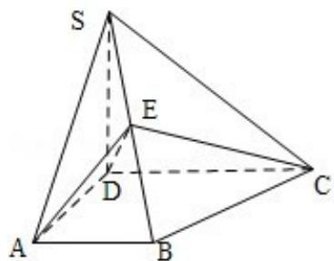

<!-- question-source:start -->
20．（12分）如图，四棱锥S-ABCD中，SD⊥底面

ABCD, AB∥DC, AD⊥DC, AB=AD=1, DC=SD=2, E为棱SB上的一点, 平面EDC⊥平

面 SBC.

(Ⅰ) 证明: SE=2EB;

（II）求二面角 A - DE - C 的大小.

<!-- question-source:end -->

![[高中/真题/按年份分类/2010/2010年全国统一高考数学试卷_文科__大纲版ⅰ__含解析版_/解答题/题目/answers/Q00027042A1.md]]
