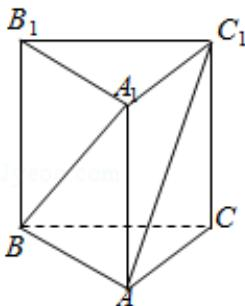

<!-- question-source:start -->
6. (5 分) 直三棱柱 $ABC - A_{1}B_{1}C_{1}$ 中, 若 $\angle BAC = 90^{\circ}$ , $AB = AC = AA_{1}$ , 则异面直线 $BA_{1}$ 与 $AC_{1}$ 所成的角等于 ( )

A. $30^{\circ}$ B. $45^{\circ}$ C. $60^{\circ}$ D. $90^{\circ}$
<!-- question-source:end -->

![[高中/真题/按年份分类/2010/2010年全国统一高考数学试卷_文科__大纲版ⅰ__含解析版_/选择题/题目/answers/Q00027029A1.md]]
