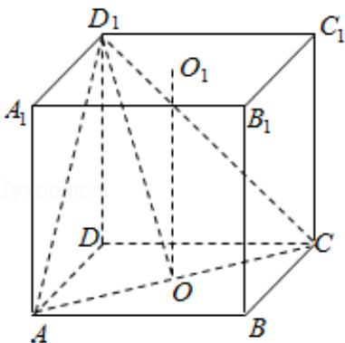

> [!faq]- 2010年全国统一高考数学试卷（文科）（大纲版ⅰ）（含解析版）解析
>
> > [!success]- **【答案】** D
>
> > [!note]- **【分析】**
> > 正方体上下底面中心的连线平行于 $\mathrm{BB}_1$ ，上下底面中心的连线与平面 $\mathrm{ACD}_1$
>
> > [!note]- **【解析】**
> > 解：如图，设上下底面的中心分别为 $O_{1}$ ，O，设正方体的棱长等于 1，
> > 则 $O_{1}O$ 与平面 $ACD_{1}$ 所成角就是 $BB_{1}$ 与平面 $ACD_{1}$ 所成角，即 $\angle O_{1}OD_{1}$ ，
> >
> > 直角三角形 $OO_{1}D_{1}$ 中， $\cos\angle O_{1}OD_{1}=\frac{O_{1}O}{OD_{1}}=\frac{\frac{1}{\sqrt{6}}}{\frac{2}{3}}=\frac{\sqrt{6}}{3}$
> >
> > 故选：D.
> >
> > 
> >
> > 【点评】本小题主要考查正方体的性质、直线与平面所成的角、点到平面的距离的
> > 求法，利用等体积转化求出 D 到平面
> >
> > $ACD_{1}$ 的距离是解决本题的关键所在，这也是转化思想的具体体现，属于中档题.
