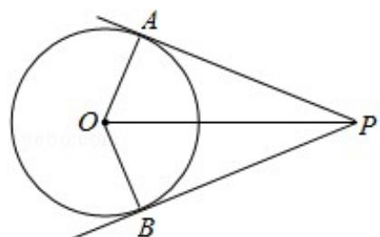

> [!faq]- 2010年全国统一高考数学试卷（文科）（大纲版ⅰ）（含解析版）解析
>
> > [!success]- **【答案】** D
>
> > [!note]- **【分析】**
> > 要求 $\overrightarrow{\mathrm{PA}}\cdot \overrightarrow{\mathrm{PB}}$ 的最小值，我们可以根据已知中，圆O的半径为1，PA、PB为该
>
> > [!note]- **【解析】**
> > 分析】要求 $\overrightarrow{\mathrm{PA}}\cdot \overrightarrow{\mathrm{PB}}$ 的最小值，我们可以根据已知中，圆O的半径为1，PA、PB为该
> >
> > 圆的两条切线，A、B为两切点，结合切线长定理，设出PA，PB的长度和夹角，并
> >
> > 将 $\overrightarrow{\mathrm{PA}}\cdot \overrightarrow{\mathrm{PB}}$ 表示成一个关于 $x$ 的函数，然后根据求函数最值的办法，进行
> > 解答.
> >
> > 【
> > 解答】解：如图所示：设 OP=x（x>0），
> >
> > 则 PA=PB= $\sqrt{x^{2}-1}$ ,
> >
> > $\angle APO=\alpha$ ，则 $\angle APB=2\alpha$ ，
> >
> > $\sin \alpha = \frac{1}{x}$
> >
> > $$
> > \overrightarrow {\mathrm{PA}} \cdot \overrightarrow {\mathrm{PB}} = \overrightarrow {| \mathrm{PA} |} \cdot | \overrightarrow {\mathrm{PB}} | \cos 2 \alpha
> > $$
> >
> > $$
> > = \sqrt {x ^ {2} - 1} \times \sqrt {x ^ {2} - 1} (1 - 2 \sin^ {2} \alpha)
> > $$
> >
> > $$
> > = (x ^ {2} - 1) \quad (1 - \frac {2}{x ^ {2}}) = \frac {x ^ {4} - 3 x ^ {2} + 2}{x ^ {2}}
> > $$
> >
> > $$
> > = x ^ {2} + \frac {2}{x ^ {2}} - 3 \geq 2 \sqrt {2} - 3,
> > $$
> >
> > ∴当且仅当 $x^{2}=\sqrt{2}$ 时取 “=”，故 $\overrightarrow{PA}\cdot\overrightarrow{PB}$ 的最小值为 $2\sqrt{2}-3$ .
> >
> > 故选：D.
> >
> > 
> >
> > 【点评】本小题主要考查向量的数量积运算与圆的切线长定理，着重考查最值的求法 -- 判别式法，同时也考查了考生综合运用数学知识解题的能力及运算能力.
