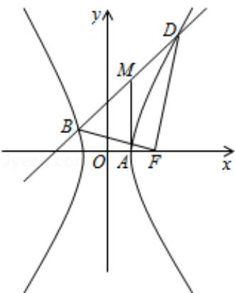

> [!faq]- 2010年全国统一高考数学试卷（文科）（大纲版ⅱ）（含解析版）解析
>
> > [!success]- **【答案】** 详见解析
>
> > [!note]- **【分析】**
> > （Ⅰ）由直线过点(1,3)及斜率可得直线方程，直线与双曲线交于BD两点
>
> > [!note]- **【解析】**
> > 解：（Ⅰ）由题设知，Ⅰ的方程为： $y=x+2$ ，代入C的方程，并化简，
> >
> > 得 $(b^{2}-a^{2})x^{2}-4a^{2}x-a^{2}b^{2}-4a^{2}=0,$
> >
> > 设 B $(x_{1}, y_{1})$ ，D $(x_{2}, y_{2})$ ，则 $x_{1} + x_{2} = \frac{4a^{2}}{b^{2} - a^{2}}$ ， $x_{1}x_{2} = -\frac{4a^{2} + a^{2}b^{2}}{b^{2} - a^{2}}$ ，①
> >
> > 由 M（1，3）为 BD 的中点知 $\frac{x_{1}+x_{2}}{2}=1$ .
> >
> > 故 $\frac{1}{2} \times \frac{4a^2}{b^2 - a^2} = 1$ ，即 $b^2 = 3a^2$ ，②
> >
> > 故 $c=\sqrt{a^{2}+b^{2}}=2a,$
> >
> > ∴C 的离心率 $e=\frac{c}{a}=2$ .
> >
> > （Ⅱ）由①②知，C的方程为： $3x^{2}-y^{2}=3a^{2}$ ，A（a，0），F（2a，0），
> >
> > $$
> > \mathrm{x} _ {1} + \mathrm{x} _ {2} = 2, \quad \mathrm{x} _ {1} \mathrm{x} _ {2} = - \frac {4 + 3 \mathrm{a} ^ {2}}{2}.
> > $$
> >
> > 故不妨设 $x_{1} \leq -a, \quad x_{2} \geq a,$
> >
> > $$
> > \left| \mathrm{BF} \right| = \sqrt {\left(\mathrm{x} _ {1} - 2 \mathrm{a}\right) ^ {2} + \mathrm{y} _ {1} ^ {2}} = \mathrm{a} - 2 \mathrm{x} _ {1}, \quad \left| \mathrm{FD} \right| = \sqrt {\left(\mathrm{x} _ {2} - 2 \mathrm{a}\right) ^ {2} + \mathrm{y} _ {2} ^ {2}} = 2 \mathrm{x} _ {2} - \mathrm{a},
> > $$
> >
> > $$
> > \left| \mathrm{BF} \right| \bullet \left| \mathrm{FD} \right| = (a - 2 x _ {1}) (2 x _ {2} - a) = - 4 x _ {1} x _ {2} + 2 a (x _ {1} + x _ {2}) - a ^ {2} = 5 a ^ {2} + 4 a + 8.
> > $$
> >
> > 又 $|BF|\bullet|FD|=17$ ，故 $5a^{2}+4a+8=17$ 。
> >
> > 解得 $a = 1$ ，或 $a = -\frac{9}{5}$ （舍去），
> >
> > 故 $|BD|=\sqrt{2}|x_{1}-x_{2}|=\sqrt{2}\sqrt{(x_{1}+x_{2})^{2}-4x_{1}x_{2}}=6$
> >
> > 连接 MA，则由 A（1，0），M（1，3）知 $\left|MA\right|=3$ ，
> >
> > 从而 MA=MB=MD，且 MA⊥x 轴，
> >
> > 因此以 M 为圆心，MA 为半径的圆经过 A、B、D 三点，且在点 A 处与 x 轴相切，
> >
> > 所以过 A、B、D 三点的圆与 x 轴相切.
> >
> > 
> >
> > 【点评】本题考查了圆锥曲线、直线与圆的知识，考查学生运用所学知识解决问题
> >
> > 的能力。
