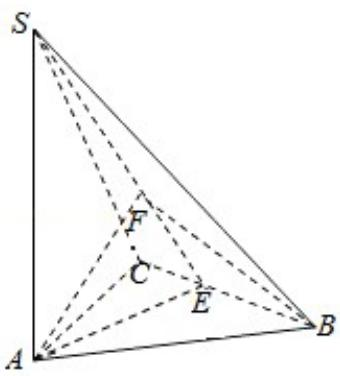

> [!faq]- 2010年全国统一高考数学试卷（文科）（大纲版ⅱ）（含解析版）解析
>
> > [!success]- **【答案】** D
>
> > [!note]- **【分析】**
> > 由图, 过 A 作 AE 垂直于 BC 交 BC 于 E, 连接 SE, 过 A 作 AF 垂直于 SE 交 SE 于 F, 连 BF, 由题设条件证出 $\angle ABF$ 即所求线面角. 由数据求出其正弦值.
>
> > [!note]- **【解析】**
> > 分析】由图, 过 A 作 AE 垂直于 BC 交 BC 于 E, 连接 SE, 过 A 作 AF 垂直于 SE 交 SE 于 F, 连 BF, 由题设条件证出 $\angle ABF$ 即所求线面角. 由数据求出其正弦值.
> >
> > 【
> > 解答】解: 过 A 作 AE 垂直于 BC 交 BC 于 E, 连接 SE, 过 A 作 AF 垂直于 SE 交 SE 于 F, 连 BF,
> >
> > ∵正三角形 ABC，
> >
> > ∴E为BC中点，
> >
> > ∵BC⊥AE，SA⊥BC，
> >
> > ∴BC⊥面 SAE，
> >
> > ∴BC⊥AF，AF⊥SE，
> >
> > ∴AF⊥面 SBC，
> >
> > ∵∠ABF为直线AB与面SBC所成角，由正三角形边长2，
> >
> > $$
> > \therefore A E = \sqrt {3}, A S = 3,
> > $$
> >
> > $\therefore SE = 2\sqrt{3}, AF = \frac{3}{2},$
> >
> > $$
> > \therefore \sin \angle A B F = \frac {3}{4}.
> > $$
> >
> > 故选：D.
> >
> > 
> >
> > 【点评】本题考查了立体几何的线与面、面与面位置关系及直线与平面所成角.
