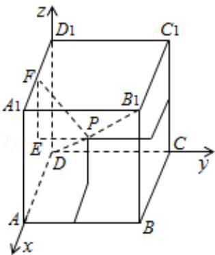

> [!faq]- 2010年全国统一高考数学试卷（文科）（大纲版ⅱ）（含解析版）解析
>
> > [!success]- **【答案】** D
>
> > [!note]- **【分析】**
> > 由于点 D、 $B_{1}$ 显然满足要求，猜想 $B_{1}D$ 上任一点都满足要求，然后想办法证
>
> > [!note]- **【解析】**
> > 解：在正方体 ABCD - A₁B₁C₁D₁ 上建立如图所示空间直角坐标系，
> >
> > 并设该正方体的棱长为 1，连接 $B_{1}D$ ，并在 $B_{1}D$ 上任取一点 P，
> >
> > 因为 $\overrightarrow{DB_1} = (1, 1, 1)$ ，
> >
> > 所以设 P（a，a，a），其中 $0 \leq a \leq 1$ .
> >
> > 作 PE⊥平面 $A_{1}D$ ，垂足为 E，再作 $EF\perp A_{1}D_{1}$ ，垂足为 F，
> >
> > 则 PF 是点 P 到直线 $A_{1}D_{1}$ 的距离.
> >
> > 所以 $PF=\sqrt{a^{2}+(1-a)^{2}}$ ;
> >
> > 同理点 P 到直线 AB、 $CC_{1}$ 的距离也是 $\sqrt{a^{2}+(1-a)^{2}}$ .
> >
> > 所以 $B_{1}D$ 上任一点与正方体 ABCD - $A_{1}B_{1}C_{1}D_{1}$ 的三条棱 AB、 $CC_{1}$ 、 $A_{1}D_{1}$ 所在直线的
> >
> > 距离都相等，
> >
> > 所以与正方体 ABCD - A₁B₁C₁D₁ 的三条棱 AB、CC₁、A₁D₁ 所在直线的距离相等的点
> >
> > 有无数个.
> >
> > 故选：D.
> >
> > 
> >
> > 【点评】本题主要考查合情推理的能力及空间中点到线的距离的求法.
