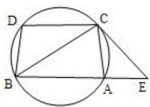

<!-- question-source:start -->
22.（10分）如图：已知圆上的弧 $\widehat{AC} = \widehat{BD}$ ，过C点的圆的切线与BA的延长线交于E

点，证明：

(1) $\angle ACE = \angle BCD$ .

(II) $BC^{2}=BE\bullet CD.$

<!-- question-source:end -->

![[高中/真题/按年份分类/2010/2010年全国统一高考数学试卷_文科__新课标__含解析版_/解答题/题目/answers/Q00025300A1.md]]
