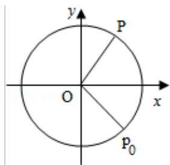
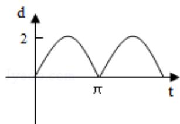
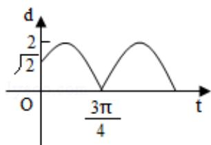
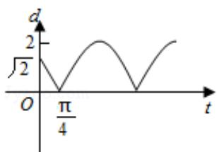
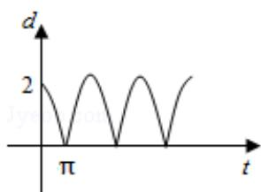

<!-- question-source:start -->
6. (5 分) 如图, 质点 P 在半径为 2 的圆周上逆时针运动, 其初始位置为 $P_{0}(\sqrt{2}, -$

$\sqrt{2}$ )，角速度为1，那么点P到x轴距离d关于时间t的函数图象大致为（ ）

A.

B.

C.

D.
<!-- question-source:end -->

![[高中/真题/按年份分类/2010/2010年全国统一高考数学试卷_文科__新课标__含解析版_/选择题/题目/answers/Q00024916A1.md]]
