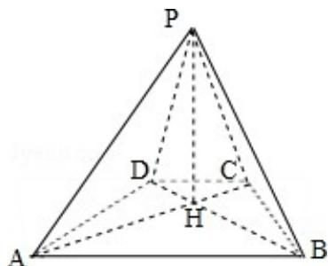

<!-- question-source:start -->
18. (10 分) 如图, 已知四棱锥 P-ABCD 的底面为等腰梯形, AB∥CD, AC⊥BD, 垂足

为 H，PH 是四棱锥的高。

(Ⅰ) 证明: 平面 PAC⊥平面 PBD;

（II）若 $AB=\sqrt{6}$ ， $\angle APB=\angle ADB=60^{\circ}$ ，求四棱锥 P-ABCD 的体积.

<!-- question-source:end -->

![[高中/真题/按年份分类/2010/2010年全国统一高考数学试卷_文科__新课标__含解析版_/选择题/题目/answers/Q00025296A1.md]]
