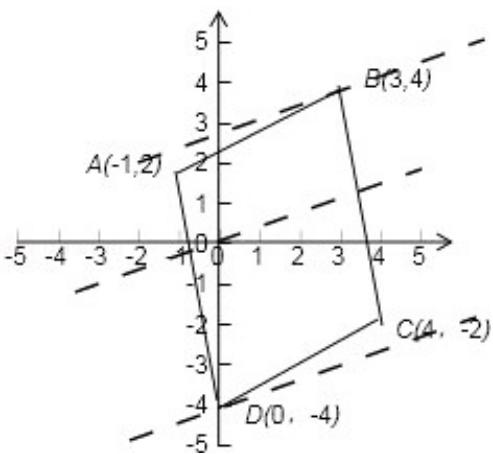

> [!faq]- 2010年全国统一高考数学试卷（文科）（新课标）（含解析版）解析
>
> > [!success]- **【答案】** B
>
> > [!note]- **【分析】**
> > 根据点坐标与向量坐标之间的关系，利用向量相等求出顶点 D 的坐标是
>
> > [!note]- **【解析】**
> > 解：由已知条件得 $\overrightarrow{AB}=\overrightarrow{DC}\Rightarrow D(0,-4)$ ，
> >
> > 由 $z = 2x - 5y$ 得 $y = \frac{2}{5} x - \frac{z}{5}$ ，平移直线当直线经过点B（3，4）时， $-\frac{z}{5}$ 最大，
> >
> > 即 z 取最小为 -14；当直线经过点 D（0，-4）时， $-\frac{z}{5}$ 最小，即 z 取最大为 20，
> >
> > 又由于点 $(x, y)$ 在四边形的内部，故 $z \in (-14, 20)$ .
> >
> > 如图：故选B.
> >
> > 
> >
> > 【点评】本题考查平行四边形的顶点之间的关系，用到向量坐标与点坐标之间的关系，体现了向量的工具作用，考查学生线性规划的理解和认识，考查学生的数形结合思想。属于基本题型。
