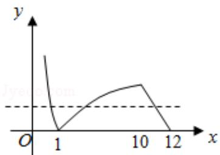

> [!faq]- 2010年全国统一高考数学试卷（文科）（新课标）（含解析版）解析
>
> > [!success]- **【答案】** C
>
> > [!note]- **【分析】**
> > 画出函数的图象, 根据 $f(a)=f(b)=f(c)$ ，不妨 a<b<c，求出 abc 的范围即
>
> > [!note]- **【解析】**
> > 解：作出函数 $f(x)$ 的图象如图，
> >
> > 不妨设 $a < b < c$ ，则
> >
> > 
> >
> > ab=1, $0<-\frac{1}{2}c+6<1$
> >
> > 则 $abc = c \in (10, 12)$ .
> >
> > 故选：C.
> >
> > 
> >
> > 【点评】本题主要考查分段函数、对数的运算性质以及利用数形结合解决问题的能力.
> >
> > ##
> > 二、填空题：本大题共4小题，每小题5分.
