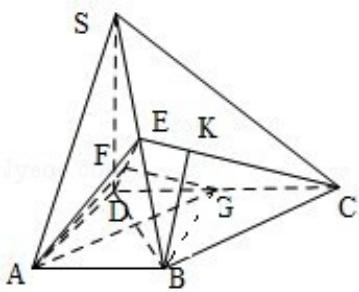

> [!faq]- 2010年全国统一高考数学试卷（理科）（大纲版ⅰ）（含解析版）解析
>
> > [!success]- **【答案】** 详见解析
>
> > [!note]- **【分析】**
> > （Ⅰ）连接 BD，取 DC 的中点 G，连接 BG，作 BK⊥EC，K 为垂足，根据线面垂
>
> > [!note]- **【解析】**
> > 分析】（Ⅰ）连接 BD，取 DC 的中点 G，连接 BG，作 BK⊥EC，K 为垂足，根据线面垂
> >
> > 直的判定定理可知 DE⊥平面 SBC，然后分别求出 SE 与 EB 的长，从而得到结论；
> >
> > （II）根据边长的关系可知 $\triangle ADE$ 为等腰三角形，取ED中点F，连接AF，连接FG，
> >
> > 根据二面角平面角的定义可知 $\angle AFG$ 是二面角A-DE-C的平面角，然后在三
> >
> > 角形 AGF 中求出二面角 A-DE-C 的大小.
> >
> > 【
> > 解答】解：（Ⅰ）连接 BD，取 DC 的中点 G，连接 BG，
> >
> > 由此知 DG=GC=BG=1，即 $\triangle DBC$ 为直角三角形，故 BC⊥BD.
> >
> > 又 SD⊥平面 ABCD，故 BC⊥SD，
> >
> > 所以，BC⊥平面 BDS，BC⊥DE.
> >
> > 作 BK⊥EC，K 为垂足，因平面 EDC⊥平面 SBC，
> >
> > 故 BK⊥平面 EDC，BK⊥DE，DE 与平面 SBC 内的两条相交直线 BK、BC 都垂直，
> >
> > DE⊥平面 SBC，DE⊥EC，DE⊥SB.
> >
> > $$
> > \mathrm{SB} = \sqrt {\mathrm{SD} ^ {2} + \mathrm{DB} ^ {2}} = \sqrt {6},
> > $$
> >
> > $$
> > D E = \frac {S D \square D B}{S B} = \frac {2}{\sqrt {3}}
> > $$
> >
> > $$
> > E B = \sqrt {D B ^ {2} - D E ^ {2}} = \frac {\sqrt {6}}{3}, \quad S E = S B - E B = \frac {2 \sqrt {6}}{3}
> > $$
> >
> > 所以 SE=2EB
> >
> > （II）由 $SA=\sqrt{SD^{2}+AD^{2}}=\sqrt{5}$ ，AB=1，SE=2EB，AB⊥SA，知
> >
> > $AE=\sqrt{\left(\frac{1}{3}SA\right)^{2}+\left(\frac{2}{3}AB\right)^{2}}=1$ ，又AD=1.
> >
> > 故 $\triangle ADE$ 为等腰三角形.
> >
> > 取ED中点F，连接AF，则 $AF \perp DE$ ， $AF = \sqrt{AD^2 - DF^2} = \frac{\sqrt{6}}{3}$ .
> >
> > 连接 FG，则 FG∥EC，FG⊥DE.
> >
> > 所以， $\angle AFG$ 是二面角 $A - DE - C$ 的平面角.
> >
> > 连接 AG， $AG=\sqrt{2}$ ， $FG=\sqrt{DG^{2}-DF^{2}}=\frac{\sqrt{6}}{3}$
> >
> > $$
> > \cos \angle A F G = \frac {A F ^ {2} + F G ^ {2} - A G ^ {2}}{2 \cdot A F \cdot F G} = - \frac {1}{2},
> > $$
> >
> > 所以，二面角 A - DE - C 的大小为 $120^{\circ}$ .
> >
> > 
> >
> > 【点评】本题主要考查了与二面角有关的立体几何综合题，考查学生空间想象能
> >
> > 力，逻辑思维能力，是中档题。
