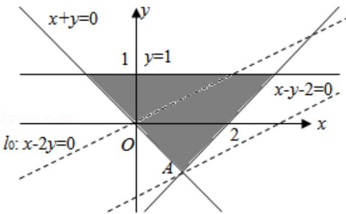

> [!faq]- 2010年全国统一高考数学试卷（理科）（大纲版ⅰ）（含解析版）解析
>
> > [!success]- **【答案】** B
>
> > [!note]- **【分析】**
> > 先根据约束条件画出可行域，再利用几何意义求最值， $z = x - 2y$ 表示直线
>
> > [!note]- **【解析】**
> > 分析】先根据约束条件画出可行域，再利用几何意义求最值， $z = x - 2y$ 表示直线
> >
> > 在 y 轴上的截距，只需求出可行域直线在 y 轴上的截距最小值即可.
> >
> > 【
> > 解答】解：画出可行域（如图）， $z=x-2y\Rightarrow y=\frac{1}{2}x-\frac{1}{2}z$
> >
> > 由图可知，
> >
> > 当直线Ⅰ经过点 A（1，-1）时，
> >
> > z 最大，且最大值为 $z_{\max}=1-2\times(-1)=3$ .
> >
> > 故选：B.
> >
> > 
> >
> > 【点评】本小题主要考查线性规划知识、作图、识图能力及计算能力，以及利用几
> > 何意义求最值，属于基础题.
