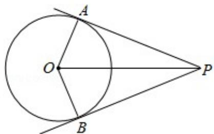

> [!faq]- 2010年全国统一高考数学试卷（理科）（大纲版ⅰ）（含解析版）解析
>
> > [!success]- **【答案】** D
>
> > [!note]- **【分析】**
> > 由题意 $f(a)=f(b)$ ，求出 ab 的关系，然后利用 “对勾” 函数的性质知函数
>
> > [!note]- **【解析】**
> > 分析】由题意 $f(a)=f(b)$ ，求出 ab 的关系，然后利用 “对勾” 函数的性质知函数
> >
> > f（a）在 $a \in (0, 1)$ 上为减函数，
> >
> > 确定 $a+2b$ 的取值范围.
> >
> > 【
> > 解答】解：因为 $f(a) = f(b)$ ，所以 $|lga| = |lgb|$ ，所以 $a = b$ （舍去），或 $b = \frac{1}{a}$ ，所以 $a + 2b = a + \frac{2}{a}$
> >
> > 又 $0 < a < b$ ，所以 $0 < a < 1 < b$ ，令 $f(a) = a + \frac{2}{a}$ ，由“对勾”函数的性质知函数 $f(a)$
> >
> > 在 $a \in (0, 1)$ 上为减函数，
> >
> > 所以 $f(a) > f(1) = 1 + \frac{2}{1} = 3$ ，即 $a + 2b$ 的取值范围是 $(3, +\infty)$ .
> >
> > 故选：C.
> >
> > 【点评】本小题主要考查对数函数的性质、函数的单调性、函数的值域，考生在做
> >
> > 本小题时极易忽视 a 的取值范围，而利用均值不等式求得 $a+2b=a+\frac{2}{a}>2\sqrt{2}$ ,
> >
> > 从而错选 A，这也是命题者的用心良苦之处。
> >
> > $\overrightarrow{\mathrm{PA}} \cdot \overrightarrow{\mathrm{PB}}$ 的最小值为（）
> > A. $-4 + \sqrt{2}$ B. $-3 + \sqrt{2}$ C. $-4 + 2\sqrt{2}$ D. $-3 + 2\sqrt{2}$
> >
> > 【考点】90：平面向量数量积的性质及其运算；JF：圆方程的综合应用.
> >
> > 【专题】5C：向量与圆锥曲线.
> >
> > 【
> > 分析】要求 $\overrightarrow{PA} \cdot \overrightarrow{PB}$ 的最小值, 我们可以根据已知中, 圆 O 的半径为 1, PA、PB 为该
> >
> > 圆的两条切线，A、B为两切点，结合切线长定理，设出PA，PB的长度和夹角，并
> >
> > 将 $\overrightarrow{\mathrm{PA}}\cdot \overrightarrow{\mathrm{PB}}$ 表示成一个关于 $x$ 的函数，然后根据求函数最值的办法，进行
> > 解答.
> >
> > 【
> > 解答】解：如图所示：设 OP=x（x>0），
> >
> > 则 PA=PB= $\sqrt{x^{2}-1}$ ,
> >
> > $\angle APO=\alpha$ ，则 $\angle APB=2\alpha$ ，
> >
> > $\sin\alpha=\frac{1}{x}$ ,
> >
> > $$
> > \overrightarrow {\mathrm{PA}} \cdot \overrightarrow {\mathrm{PB}} = \overrightarrow {| \mathrm{PA} |} \cdot | \overrightarrow {\mathrm{PB}} | \cos 2 \alpha
> > $$
> >
> > $$
> > = \sqrt {x ^ {2} - 1} \times \sqrt {x ^ {2} - 1} (1 - 2 \sin^ {2} \alpha)
> > $$
> >
> > $$
> > = (x ^ {2} - 1) \quad (1 - \frac {2}{x ^ {2}}) = \frac {x ^ {4} - 3 x ^ {2} + 2}{x ^ {2}}
> > $$
> >
> > $$
> > = x ^ {2} + \frac {2}{x ^ {2}} - 3 \geq 2 \sqrt {2} - 3,
> > $$
> >
> > ∴当且仅当 $x^{2}=\sqrt{2}$ 时取 “=”，故 $\overrightarrow{PA}\cdot\overrightarrow{PB}$ 的最小值为 $2\sqrt{2}-3$ .
> >
> > 故选：D.
> >
> > 
> >
> > 【点评】本小题主要考查向量的数量积运算与圆的切线长定理，着重考查最值的
> > 求法－－判别式法，同时也考查了考生综合运用数学知识解题的能力及运算
> > 能力.
