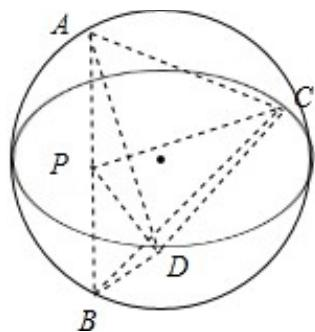

> [!faq]- 2010年全国统一高考数学试卷（理科）（大纲版ⅰ）（含解析版）解析
>
> > [!success]- **【答案】** B
>
> > [!note]- **【分析】**
> > 四面体 ABCD 的体积的最大值, AB 与 CD 是对棱, 必须垂直, 确定球心的位
>
> > [!note]- **【解析】**
> > 分析】四面体 ABCD 的体积的最大值, AB 与 CD 是对棱, 必须垂直, 确定球心的位
> >
> > 置，即可求出体积的最大值.
> >
> > 【
> > 解答】解: 过 CD 作平面 PCD, 使 AB⊥平面 PCD, 交 AB 于 P, 设点 P 到 CD 的距离为 h,
> >
> > 则有 $V_{四面体ABCD}=\frac{1}{3}\times2\times\frac{1}{2}\times2\times h=\frac{2}{3}h,$
> >
> > 当直径通过 AB 与 CD 的中点时， $h_{max}=2\sqrt{2^{2}-1^{2}}=2\sqrt{3}$ ，故 $V_{max}=\frac{4\sqrt{3}}{3}$ .
> >
> > 故选：B.
> >
> > 
> >
> > 【点评】本小题主要考查几何体的体积的计算、球的性质、异面直线的距离，通过
> >
> > 球这个载体考查考生的空间想象能力及推理运算能力.
> >
> > ## 二、填空题（共4小题，每小题5分，满分20分）
