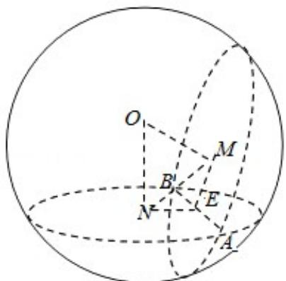
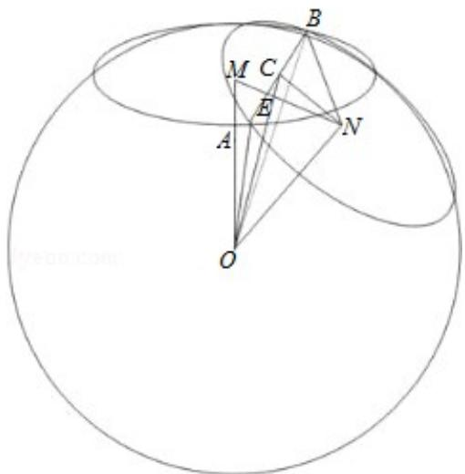

> [!faq]- 2010年全国统一高考数学试卷（理科）（大纲版ⅱ）（含解析版）解析
>
> > [!success]- **【答案】** 详见解析
>
> > [!note]- **【分析】**
> > 根据题意画出图形, 欲求两圆圆心的距离, 将它放在与球心组成的三角形
>
> > [!note]- **【解析】**
> > 解法一：∵ON=3，球半径为4，
> >
> > ∴小圆 N 的半径为 $\sqrt{7}$ ,
> >
> > ∵小圆 N 中弦长 AB=4，作 NE 垂直于 AB，
> >
> > $\therefore \mathrm{NE} = \sqrt{3}$ ，同理可得 $\mathrm{ME} = \sqrt{3}$ ，在直角三角形ONE中，
> >
> > $$
> > \because \mathrm{NE} = \sqrt {3}, \quad \mathrm{ON} = 3,
> > $$
> >
> > $\therefore \angle EON = \frac{\pi}{6},$
> >
> > $\therefore \angle MON = \frac{\pi}{3},$
> >
> > $\therefore MN=3.$
> >
> > 
> >
> > 故填：3.
> >
> > 解法二：如下图：设 AB 的中点为 C，则 OC 与 MN 必相交于 MN 中点为 E，因为
> >
> > OM=ON=3,
> >
> > 故小圆半径NB为 $\sqrt{4^2 - 3^2} = \sqrt{7}$
> >
> > C 为 AB 中点，故 CB=2；所以 NC= $\sqrt{\sqrt{7}^{2}-2^{2}}=\sqrt{3}$ ，
> >
> > ∵△ONC为直角三角形，NE为△ONC斜边上的高，OC= $\sqrt{4^{2}-2^{2}}=\sqrt{12}=2\sqrt{3}$
> >
> > $$
> > \therefore M N = 2 E N = 2 \bullet C N \bullet \frac {O N}{C O} = 2 \times \sqrt {3} \times \frac {3}{2 \sqrt {3}} = 3
> > $$
> >
> > 
> >
> > 故填：3.
> >
> > 【点评】本题主要考查了点、线、面间的距离计算，还考查球、直线与圆的基础知
> >
> > 识，考查空间想象能力、运算能力和推理论证能力，属于基础题.
> >
> > ##
> > 三、解答题（共6小题，满分70分）
