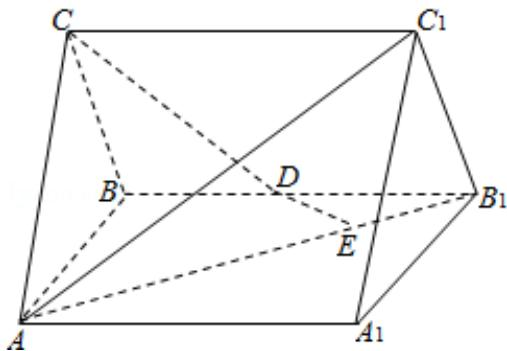

<!-- question-source:start -->
19. (12 分) 如图, 直三棱柱 $ABC - A_{1}B_{1}C_{1}$ 中, $AC = BC$ , $AA_{1} = AB$ , $D$ 为 $BB_{1}$ 的中点, $E$ 为

$AB_{1}$ 上的一点， $AE=3EB_{1}$ .

（Ⅰ）证明：DE 为异面直线 $AB_{1}$ 与 CD 的公垂线；

（II）设异面直线 $AB_{1}$ 与 CD 的夹角为 $45^{\circ}$ ，求二面角 $A_{1}-AC_{1}-B_{1}$ 的大小.

<!-- question-source:end -->

![[高中/真题/按年份分类/2010/2010年全国统一高考数学试卷_理科__大纲版ⅱ__含解析版_/解答题/题目/answers/Q00025460A1.md]]
