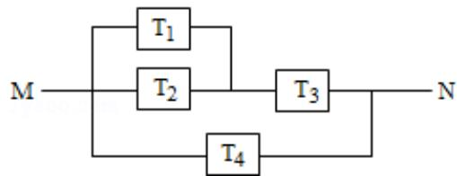

<!-- question-source:start -->
20. (12 分) 如图, 由 M 到 N 的电路中有 4 个元件, 分别标为 $T_{1}, T_{2}, T_{3}, T_{4}$ , 电流能

通过 $T_{1}$ ， $T_{2}$ ， $T_{3}$ 的概率都是 P，电流能通过 $T_{4}$ 的概率是 0.9，电流能否通过各元

件相互独立．已知 $T_{1}$ ， $T_{2}$ ， $T_{3}$ 中至少有一个能通过电流的概率为 0.999.

(Ⅰ) 求 P;

（II）求电流能在 M 与 N 之间通过的概率.

<!-- question-source:end -->

![[高中/真题/按年份分类/2010/2010年全国统一高考数学试卷_理科__大纲版ⅱ__含解析版_/解答题/题目/answers/Q00025461A1.md]]
