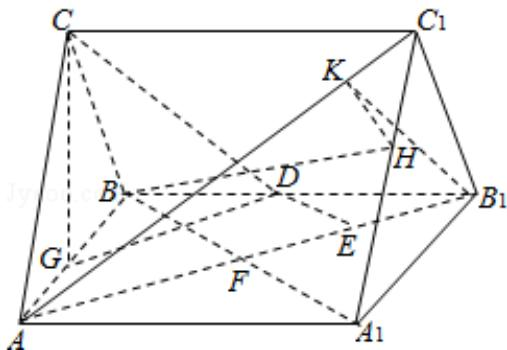

> [!faq]- 2010年全国统一高考数学试卷（理科）（大纲版ⅱ）（含解析版）解析
>
> > [!success]- **【答案】** 详见解析
>
> > [!note]- **【分析】**
> > （1）欲证 DE 为异面直线 $AB_{1}$ 与 CD 的公垂线，即证 DE 与异面直线 $AB_{1}$ 与
>
> > [!note]- **【解析】**
> > 分析】（1）欲证 DE 为异面直线 $AB_{1}$ 与 CD 的公垂线，即证 DE 与异面直线 $AB_{1}$ 与
> >
> > CD 垂直相交即可；
> >
> > (2) 将 $AB_{1}$ 平移到 DG，故 $\angle CDG$ 为异面直线 $AB_{1}$ 与 CD 的夹角，作 $HK \perp AC_{1}$ ，K 为垂
> >
> > 足，连接 $B_{1}K$ ，由三垂线定理，得 $B_{1}K \perp AC_{1}$ ，因此 $\angle B_{1}KH$ 为二面角 $A_{1}-AC_{1}-B_{1}$
> >
> > 的平面角，在三角形 $B_{1}KH$ 中求出此角即可.
> >
> > 【
> > 解答】解：（1）连接 $A_{1}B$ ，记 $A_{1}B$ 与 $AB_{1}$ 的交点为 F.
> >
> > 因为面 $AA_{1}BB_{1}$ 为正方形，故 $A_{1}B \perp AB_{1}$ ，且 $AF = FB_{1}$ ，
> >
> > 又 $AE=3EB_{1}$ ，所以 $FE=EB_{1}$ ，
> >
> > 又 D 为 $BB_{1}$ 的中点，
> >
> > 故 DE∥BF，DE⊥AB₁.
> >
> > 作 CG⊥AB，G 为垂足，由 AC=BC 知，G 为 AB 中点.
> >
> > 又由底面 ABC⊥面 AA₁B₁B．连接 DG，则 DG∥AB₁，
> >
> > 故 DE⊥DG，由三垂线定理，得 DE⊥CD.
> >
> > 所以 DE 为异面直线 $AB_{1}$ 与 CD 的公垂线.
> >
> > (2) 因为 $DG \parallel AB_{1}$ , 故 $\angle CDG$ 为异面直线 $AB_{1}$ 与 $CD$ 的夹角, $\angle CDG = 45^{\circ}$
> >
> > 设 AB=2，则 $AB_{1}=2\sqrt{2}$ ，DG= $\sqrt{2}$ ，CG= $\sqrt{2}$ ，AC= $\sqrt{3}$ 。
> >
> > 作 $B_{1}H \perp A_{1}C_{1}$ ，H 为垂足，因为底面 $A_{1}B_{1}C_{1} \perp$ 面 $AA_{1}CC_{1}$ ，故 $B_{1}H \perp$ 面 $AA_{1}C_{1}C$ 。又作
> >
> > $HK\perp AC_{1},K$ 为垂足，连接 $B_{1}K$ ，由三垂线定理，得 $B_{1}K\perp AC_{1}$ ，因此 $\angle B_{1}KH$ 为二面
> >
> > 角 $A_{1}-AC_{1}-B_{1}$ 的平面角.
> >
> > $$
> > \mathrm{B} _ {1} \mathrm{H} = \frac {2 \sqrt {6}}{3}, \quad \mathrm{C} _ {1} \mathrm{H} = \frac {\sqrt {3}}{3}, \quad \mathrm{AC} _ {1} = \sqrt {7}, \quad \mathrm{HK} = \frac {2 \sqrt {2 1}}{2 1}
> > $$
> >
> > $$
> > \tan \angle B _ {1} K H = \sqrt {1 4},
> > $$
> >
> > ∴二面角 $A_{1}-AC_{1}-B_{1}$ 的大小为 $\arctan\sqrt{14}$ .
> >
> > 
> >
> > 【点评】本试题主要考查空间的线面关系与空间角的求解，考查考生的空间想象
> > 与推理计算的能力。三垂线定理是立体几何的最重要定理之一，是高考的热
> > 点，它是处理线线垂直问题的有效方法，同时它也是确定二面角的平面角的
> > 主要手段。通过引入空间向量，用向量代数形式来处理立体几何问题，淡化了
> > 传统几何中的“形”到“形”的推理方法，从而降低了思维难度，使解题变
> > 得程序化，这是用向量解立体几何问题的独到之处。
