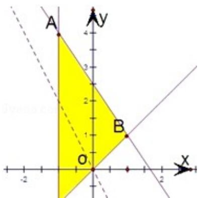

> [!faq]- 2010年全国统一高考数学试卷（理科）（大纲版ⅱ）（含解析版）解析
>
> > [!success]- **【答案】** C
>
> > [!note]- **【分析】**
> > 先根据约束条件画出可行域，设 $z = 2x + y$ ，再利用 $z$ 的几何意义求最值，只
>
> > [!note]- **【解析】**
> > 分析】先根据约束条件画出可行域，设 $z = 2x + y$ ，再利用 $z$ 的几何意义求最值，只
> >
> > 需求出直线 $z = 2x + y$ 过可行域内的点B时，从而得到 $\mathfrak{m}$ 值即可.
> >
> > 【
> > 解答】解：作出可行域，作出目标函数线，
> >
> > 可得直线与 y=x 与 $3x+2y=5$ 的交点为最优解点，
> >
> > ∴即为 B（1，1），当 x=1，y=1 时 $z_{max}=3$ 。
> >
> > 故选：C.
> >
> > 
> >
> > 【点评】本题考查了线性规划的知识，以及利用几何意义求最值，属于基础题.
