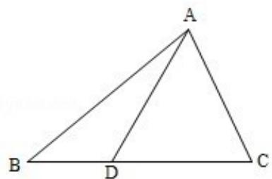

> [!faq]- 2010年全国统一高考数学试卷（理科）（新课标）（含解析版）解析
>
> > [!success]- **【答案】** (5分) 在 $\triangle ABC$ 中, D为边BC上一点, $BD=\frac{1}{2}DC$ , $\angle ADB=120^{\circ}$ , $AD=2$ , 若 $\triangle ADC$
>
> > [!note]- **【分析】**
> > 先根据三角形的面积公式利用 $\triangle ADC$ 的面积求得 DC，进而根据三角形
>
> > [!note]- **【解析】**
> > 解：由△ADC的面积为 $3-\sqrt{3}$ 可得
> >
> > $$
> > S _ {\triangle A D C} = \frac {1}{2} \cdot A D \cdot D C \cdot \sin 6 0 ^ {\circ} = \frac {\sqrt {3}}{2} D C = 3 - \sqrt {3}
> > $$
> >
> > $$
> > S _ {\triangle A B C} = \frac {3}{2} (3 - \sqrt {3}) = \frac {1}{2} A B \cdot A C \cdot \sin \angle B A C
> > $$
> >
> > 解得 $DC = 2\sqrt{3} - 2$ ，则 $BD = \sqrt{3} - 1$ ， $BC = 3\sqrt{3} - 3.$
> >
> > $$
> > A B ^ {2} = A D ^ {2} + B D ^ {2} - 2 A D \bullet B D \bullet \cos 1 2 0 ^ {\circ} = 4 + (\sqrt {3} - 1) ^ {2} + 2 (\sqrt {3} - 1) = 6,
> > $$
> >
> > $$
> > \mathrm{AB} = \sqrt {6},
> > $$
> >
> > $$
> > A C ^ {2} = A D ^ {2} + C D ^ {2} - 2 A D \cdot C D \cdot \cos 6 0 ^ {\circ} = 4 + 4 (\sqrt {3} - 1) ^ {2} - 4 (\sqrt {3} - 1) = 2 4 - 1 2 \sqrt {3}
> > $$
> >
> > $$
> > A C = \sqrt {6} (\sqrt {3} - 1)
> > $$
> >
> > $$
> > \text {则} \cos \angle B A C = \frac {B A ^ {2} + A C ^ {2} - B C ^ {2}}{2 A B \cdot A C} = \frac {6 + 2 4 - 1 2 \sqrt {3} - 9 (4 - 2 \sqrt {3})}{2 \sqrt {6} \cdot \sqrt {6} (\sqrt {3} - 1)} = \frac {6 \sqrt {3} - 6}{1 2 (\sqrt {3} - 1)} = \frac {1}{2}.
> > $$
> >
> > 故 $\angle BAC=60^{\circ}$ .
> >
> > 
