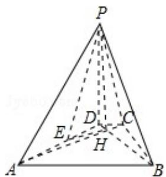

<!-- question-source:start -->
18. (12 分) 如图, 已知四棱锥 P-ABCD 的底面为等腰梯形, AB∥CD, AC⊥BD, 垂足

为 H，PH 是四棱锥的高，E 为 AD 中点

(Ⅰ) 证明: PE⊥BC

（II）若 $\angle APB = \angle ADB = 60^{\circ}$ ，求直线PA与平面PEH所成角的正弦值.

<!-- question-source:end -->

![[高中/真题/按年份分类/2010/2010年全国统一高考数学试卷_理科__新课标__含解析版_/解答题/题目/answers/Q00027016A1.md]]
