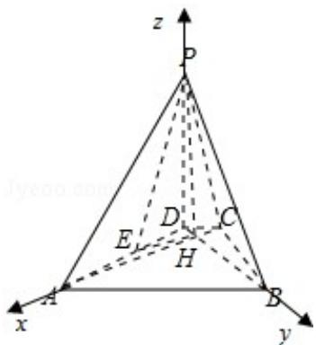

> [!faq]- 2010年全国统一高考数学试卷（理科）（新课标）（含解析版）解析
>
> > [!success]- **【答案】** 详见解析
>
> > [!note]- **【分析】**
> > 以 H 为原点, HA, HB, HP 分别为 x, y, z 轴, 线段 HA 的长为单位长, 建立空
>
> > [!note]- **【解析】**
> > 解：以 H 为原点，HA，HB，HP 分别为 x，y，z 轴，线段 HA 的长为单位长，
> >
> > 建立空间直角坐标系如图，则 A（1，0，0），B（0，1，0）
> >
> > (Ⅰ) 设 C (m, 0, 0), P (0, 0, n) (m < 0, n > 0)
> >
> > 则 $D(0, m, 0)$ ， $E(\frac{1}{2}, \frac{m}{2}, 0)$ .
> >
> > 可得 $\overline{\mathrm{PE}} = (\frac{1}{2},\frac{\mathrm{m}}{2}, - \mathrm{n}),\overline{\mathrm{BC}} = (\mathrm{m}, - 1,0).$
> >
> > 因为 $\overline{\mathrm{PE}}\cdot \overline{\mathrm{BC}} = \frac{\mathrm{m}}{2} -\frac{\mathrm{m}}{2} +0 = 0$
> >
> > 所以 PE⊥BC.
> >
> > （Ⅱ）由已知条件可得 $m = \frac{\sqrt{3}}{3}$ ， $n = 1$ ，故 $C(-\frac{\sqrt{3}}{3}, 0, 0)$ ，
> >
> > $D(0, -\frac{\sqrt{3}}{3}, 0), E(\frac{1}{2}, \frac{\sqrt{3}}{6}, 0), P(0, 0, 1)$
> >
> > 设 $\vec{\mathbf{n}} = (x, y, z)$ 为平面PEH的法向量
> >
> > 则 $\left\{ \begin{array}{l} \overrightarrow{\mathrm{n}}\cdot \overrightarrow{\mathrm{HE}} = 0\\ \overrightarrow{\mathrm{n}}\cdot \overrightarrow{\mathrm{HP}} = 0 \end{array} \right.$ 即 $\left\{ \begin{array}{l}\frac{1}{2}\mathrm{x} - \frac{\sqrt{3}}{6}\mathrm{y} = 0\\ \mathrm{z} = 0 \end{array} \right.$
> >
> > 因此可以取 $\vec{n}=(1,\sqrt{3},0)$ ,
> >
> > 由 $\overrightarrow{\mathrm{PA}} = (1,0,-1)$
> >
> > 可得 $|\cos < \overrightarrow{PA}, \overrightarrow{n} > | = \frac{\sqrt{2}}{4}$
> >
> > 所以直线 PA 与平面 PEH 所成角的正弦值为 $\frac{\sqrt{2}}{4}$ .
> >
> > 
> >
> > 【点评】本题主要考查空间几何体中的位置关系、线面所成的角等知识，考查空间
> >
> > 想象能力以及利用向量法研究空间的位置关系以及线面角问题的能力.
