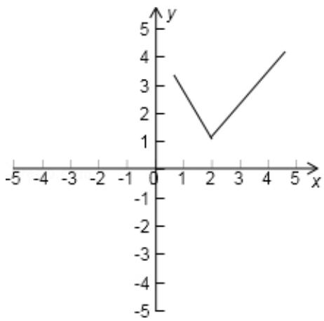

> [!faq]- 2010年全国统一高考数学试卷（理科）（新课标）（含解析版）解析
>
> > [!success]- **【答案】** 详见解析
>
> > [!note]- **【分析】**
> > (1) 先讨论 $x$ 的范围, 将函数 $f(x)$ 写成分段函数, 然后根据分段函数分段
>
> > [!note]- **【解析】**
> > 分析】(1) 先讨论 $x$ 的范围, 将函数 $f(x)$ 写成分段函数, 然后根据分段函数分段
> >
> > 画出函数的图象即可；
> >
> > (Ⅱ) 根据函数 $y=f(x)$ 与函数 y=ax 的图象可知先寻找满足 $f(x) \leqslant ax$ 的零界情况，
> >
> > 从而求出 a 的范围.
> >
> > 【
> > 解答】解：（1）由于 $f(x) = \begin{cases} -2x + 5, & x < 2 \\ 2x - 3, & x \geqslant 2 \end{cases}$ ，
> >
> > 函数 y=f(x) 的图象如图所示.
> >
> > （II）由函数 $y = f(x)$ 与函数 $y = ax$ 的图象可知，极小值在点（2，1）
> >
> > 当且仅当 $a < -2$ 或 $a \geq \frac{1}{2}$ 时，函数 $y = f(x)$ 与函数 $y = ax$ 的图象有交点。
> >
> > 故不等式 $f(x) \leqslant ax$ 的解集非空时，
> >
> > a 的取值范围为 $(-\infty, -2) \cup [\frac{1}{2}, +\infty)$ .
> >
> > 
> >
> > 【点评】本题主要考查了函数的图象, 以及利用函数图象解不等式, 同时考查了数
> > 形结合的数学思想，属于基础题.
