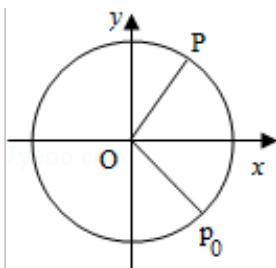
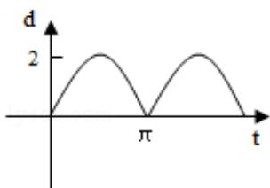
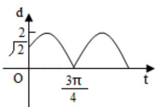
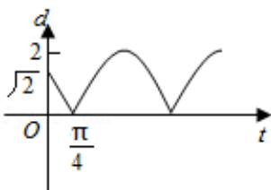
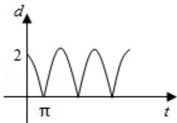

<!-- question-source:start -->
4. (5 分) 如图, 质点 P 在半径为 2 的圆周上逆时针运动, 其初始位置为 $P_{0}(\sqrt{2}, -\sqrt{2})$ , 角速度为 1, 那么点 P 到 x 轴距离 d 关于时间 t 的函数图象大致为 ( )

A.

B.

C.  

D.

<!-- question-source:end -->

![[高中/真题/按年份分类/2010/2010年全国统一高考数学试卷_理科__新课标__含解析版_/选择题/题目/answers/Q00027003A1.md]]
