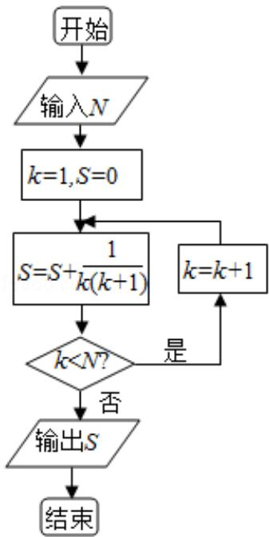

<!-- question-source:start -->
7. （5分）如果执行如图的框图，输入 $N = 5$ ，则输出的数等于（）

A. $\frac{5}{4}$ B. $\frac{4}{5}$ C. $\frac{6}{5}$ D. $\frac{5}{6}$
<!-- question-source:end -->

![[高中/真题/按年份分类/2010/2010年全国统一高考数学试卷_理科__新课标__含解析版_/选择题/题目/answers/Q00027256A1.md]]
