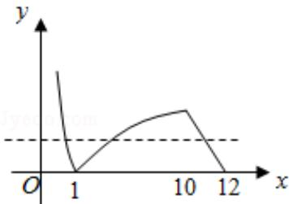

> [!faq]- 2010年全国统一高考数学试卷（理科）（新课标）（含解析版）解析
>
> > [!success]- **【答案】** C
>
> > [!note]- **【分析】**
> > 画出函数的图象, 根据 $f(a) = f(b) = f(c)$ , 不妨 $a < b < c$ , 求出 abc 的范围即可.
>
> > [!note]- **【解析】**
> > 分析】画出函数的图象, 根据 $f(a) = f(b) = f(c)$ , 不妨 $a < b < c$ , 求出 abc 的范围即可.
> >
> > 【
> > 解答】解：作出函数 $f(x)$ 的图象如图，
> >
> > 不妨设 $a < b < c$ ，则 $-\lg a = \lg b = \frac{1}{2} c + 6 \in (0, 1)$ $ab = 1$ ， $0 < -\frac{1}{2} c + 6 < 1$ 则 $abc = c \in (10, 12)$ .
> >
> > 故选：C.
> >
> > 
> >
> > 【点评】本题主要考查分段函数、对数的运算性质以及利用数形结合解决问题的能力.
