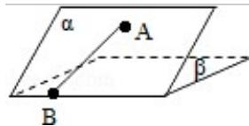

<!-- question-source:start -->
15. (4分) (2010·四川) 如图, 二面角 $\alpha - 1 - \beta$ 的大小是 $60^{\circ}$ , 线段 $AB \subset \alpha$ . $B \in I$ , AB 与 $I$ 所成的角为 $30^{\circ}$ . 则 AB 与平面 $\beta$ 所成的角的正弦值是\_\_\_\_.

<!-- question-source:end -->

![[高中/真题/按年份分类/2010/2010年四川高考文科数学试卷_word版_和答案/填空题/题目/answers/Q00024043A1.md]]
