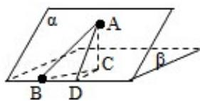

> [!faq]- 2010年四川高考文科数学试卷(word版)和答案解析
>
> > [!success]- **【答案】** 为 $\frac{\sqrt{3}}{4}$ .  【点评】本题主要考查了平面与平面之间的位置关系，以及直线与平面所成角，考查空间想象能力、运算能力和推理论证能力，属于基础题.
>
> > [!note]- **【分析】**
> > 过点 A 作平面 $\beta$ 的垂线，垂足为 C，在 $\beta$ 内过 C 作 l 的垂线。垂足为 D，连接 AD，从而 $\angle ADC$ 为二面角 $\alpha - 1 - \beta$ 的平面角，连接 CB，则 $\angle ABC$ 为 AB 与平面 $\beta$ 所成的角，在直角三角形 ABC 中求出此角即可。
>
> > [!note]- **【解析】**
> > 分析】过点 A 作平面 $\beta$ 的垂线，垂足为 C，在 $\beta$ 内过 C 作 l 的垂线。垂足为 D，连接 AD，从而 $\angle ADC$ 为二面角 $\alpha - 1 - \beta$ 的平面角，连接 CB，则 $\angle ABC$ 为 AB 与平面 $\beta$ 所成的角，在直角三角形 ABC 中求出此角即可。
> >
> > 【
> > 解答】解：过点 A 作平面 $\beta$ 的垂线，垂足为 C，
> >
> > 在 $\beta$ 内过C作1的垂线．垂足为D
> >
> > 连接 AD，有三垂线定理可知 AD⊥l，
> >
> > 故 $\angle ADC$ 为二面角 $\alpha - 1 - \beta$ 的平面角，为 $60^{\circ}$
> >
> > 又由已知， $\angle ABD = 30^{\circ}$
> >
> > 连接 CB，则 $\angle ABC$ 为 AB 与平面 $\beta$ 所成的角
> >
> > 设 $\mathrm{AD} = 2$ ，则 $\mathrm{AC} = \sqrt{3}$ ， $\mathrm{CD} = 1$
> >
> > $$
> > \mathrm{AB} = \frac {\mathrm{AD}}{\sin 3 0 ^ {0}} = 4
> > $$
> >
> > $$
> > \therefore \sin \angle A B C = \frac {A C}{A B} = \frac {\sqrt {3}}{4};
> > $$
> >
> > 故
> > 答案为 $\frac{\sqrt{3}}{4}$ .
> >
> > 
> >
> > 【点评】本题主要考查了平面与平面之间的位置关系，以及直线与平面所成角，考查空间想象能力、运算能力和推理论证能力，属于基础题.
