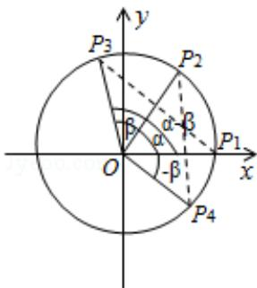

> [!faq]- 2010年四川高考文科数学试卷(word版)和答案解析
>
> > [!success]- **【答案】** 详见解析
>
> > [!note]- **【分析】**
> > (Ⅰ)①建立单位圆,在单位圆中作出角,找出相应的单位圆上的点的坐标,由两点间距离公式建立方程化简整理既得;②由诱导公式 $\cos\left[\frac{\pi}{2}-(\alpha+\beta)\right]=\sin(\alpha+\beta)$ 变形整理可得.
>
> > [!note]- **【解析】**
> > 【分析】(Ⅰ)①建立单位圆,在单位圆中作出角,找出相应的单位圆上的点的坐标,由两点间距离公式建立方程化简整理既得;②由诱导公式 $\cos\left[\frac{\pi}{2}-(\alpha+\beta)\right]=\sin(\alpha+\beta)$ 变形整理可得.
> >
> > （II） $S=\frac{1}{2}$ ， $\overrightarrow{AB}\cdot\overrightarrow{AC}=3$ ，求出角A的正弦，再由 $\cos B=\frac{3}{5}$ ，用 $\cos C=-\cos(A+B)$ 求解即可.
> >
> > $$
> > 0
> > $$
> >
> > $$
> > \mathrm{Ox}
> > $$
> >
> > 交 $\odot O$ 于点 $P_{1}$ ，终边交 $\odot O$ 于 $P_{2}$ ；角 $\beta$ 的始边为 $OP_{2}$ ，
> >
> > 终边交 $\odot O$ 于 $P_{3}$ ; 角 $-\beta$ 的始边为 $OP_{1}$ , 终边交 $\odot O$ 于 $P_{4}$ .
> >
> > $$
> > \mathrm{P} _ {1} (1, 0), \mathrm{P} _ {2} (\cos \alpha , \sin \alpha)
> > $$
> >
> > $$
> > \mathrm{P} _ {3} (\cos (\alpha + \beta), \sin (\alpha + \beta))
> > $$
> >
> > $$
> > \mathrm{P} _ {4} (\cos (- \beta), \sin (- \beta))
> > $$
> >
> > 由 $\mathrm{P_1P_3 = P_2P_4}$ 及两点间的距离公式，得
> >
> > $\left[\cos (\alpha + \beta) - 1\right] ^{2} + \sin^{2} (\alpha + \beta) = [\cos (-\beta) - \cos \alpha ]^{2} + [\sin (-\beta) - \sin \alpha ]^{2}$ 展开并整理得： $2 - 2 \cos (\alpha + \beta) = 2 - 2 (\cos \alpha \cos \beta - \sin \alpha \sin \beta)$ $\therefore \cos (\alpha + \beta) = \cos \alpha \cos \beta - \sin \alpha \sin \beta;\quad (4 \text{ 分})$ ② 由①易得 $\cos \left(\frac{\pi}{2} - \alpha\right) = \sin \alpha, \sin \left(\frac{\pi}{2} - \alpha\right) = \cos \alpha$ $\sin (\alpha + \beta) = \cos \left[-\frac{\pi}{2} - (\alpha + \beta)\right] = \cos \left[ \left(\frac{\pi}{2} - \alpha\right) + (-\beta) \right]$ $= \cos \left(\frac{\pi}{2} - \alpha\right) \cos (-\beta) - \sin \left(\frac{\pi}{2} - \alpha\right) \sin (-\beta)$ $= \sin \alpha \cos \beta + \cos \alpha \sin \beta;\quad (6 \text{ 分})$
> >
> > (II) $\because \alpha \in (\pi, \frac{3\pi}{2})$ ， $\cos \alpha = -\frac{4}{5}$
> >
> > $\therefore \sin \alpha = -\frac{3}{5}$
> >
> > $$
> > \because \beta \in (\frac {\pi}{2}, \pi), \tan \beta = - \frac {1}{3}
> > $$
> >
> > $$
> > \therefore \cos \beta = - \frac {3 \sqrt {1 0}}{1 0}, \sin \beta = \frac {\sqrt {1 0}}{1 0}
> > $$
> >
> > cos (α+β) = cos α cos β - sin α sin β
> >
> > $$
> > = (- \frac {4}{5}) \times (- \frac {3 \sqrt {1 0}}{1 0}) - (- \frac {3}{5}) \times \frac {\sqrt {1 0}}{1 0}
> > $$
> >
> > $$
> > = \frac {3 \sqrt {1 0}}{1 0}.
> > $$
> >
> > 
> >
> > 【点评】本小题主要考查两角和的正、余弦公式、诱导公式、同角三角函数间的关系等基础知识及运算能力.
