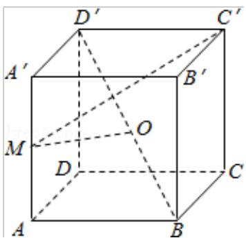

<!-- question-source:start -->
18.（12分）（2010·四川）在正方体ABCD-A'B'C'D'中，点M是棱AA'的中点，点O是对角线BD'的中点.

（Ⅰ）求证：OM 为异面直线 AA' 和 BD' 的公垂线；

（Ⅱ）求二面角 M - BC' - B' 的大小.

<!-- question-source:end -->

![[高中/真题/按年份分类/2010/2010年四川高考文科数学试卷_word版_和答案/解答题/题目/answers/Q00024046A1.md]]
