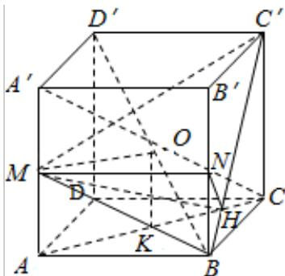
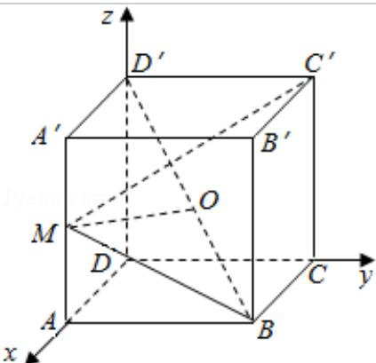

> [!faq]- 2010年四川高考文科数学试卷(word版)和答案解析
>
> > [!success]- **【答案】** 详见解析
>
> > [!note]- **【分析】**
> > 解法一：（1）由题意及图形，利用正方体的特点及异面直线间的公垂线的定义可以求证；
>
> > [!note]- **【解析】**
> > 分析】解法一：（1）由题意及图形，利用正方体的特点及异面直线间的公垂线的定义可以求证；
> >
> > (2) 由题意及图形, 利用三垂线定理, 求出所求的二面角的平面角, 然后再在三角形中求出角的大小.
> >
> > 解法二：（1）由题意及正方体的特点可以建立如图示的空间直角坐标系，利用向量的知识证明两条直线垂直；
> >
> > (2) 由题意及空间向量的知识, 抓好两平面的法向量与二面角之间的关系进而可以求出二面角的大小
> >
> > 【
> > 解答】解：法一（1）连接 AC，取 AC 中点 K，
> >
> > 则 K 为 BD 的中点，连接 OK
> >
> > 因为 M 是棱 AA' 的中点，点 O 是 BD' 的中点
> >
> > 所以 AM $\frac{1}{2}$ DD' OK
> >
> > 所以MO $\underline{\underline{\underline{\underline{\underline{\underline{\underline{\underline{\underline{AK}}}}}}}}}$
> >
> > 由 AA'⊥AK，得 MO⊥AA'
> >
> > 因为 AK⊥BD，AK⊥BB'，所以 AK⊥平面 BDD'B'
> >
> > 所以 AK⊥BD'
> >
> > 所以 MO⊥BD'
> >
> > 又因为 OM 是异面直线 AA' 和 BD' 都相交
> >
> > 故 OM 为异面直线 AA' 和 BD' 的公垂线；
> >
> > (2) 取 BB' 中点 N，连接 MN，
> >
> > 则 MN⊥平面 BCC'B'
> >
> > 过点 N 作 NH⊥BC'于 H，连接 MH
> >
> > 则由三垂线定理得 BC'⊥MH
> >
> > 从而， $\angle$ MHN为二面角M-BC'-B'的平面角
> >
> > MN=1, NH=Bnsin45°= $\frac{1}{2}\cdot\frac{\sqrt{2}}{2}=\frac{\sqrt{2}}{4}$ 在 Rt△MNH 中， $\tan\angle MHN=\frac{MN}{NH}=\frac{1}{\frac{\sqrt{2}}{4}}=2\sqrt{2}$ 故二面角 $M - BC' - B'$ 的大小为 $\arctan2\sqrt{2}$ .
> >
> > 
> >
> > 法二：
> >
> > 以点 D 为坐标原点，建立如图所示空间直角坐标系 D - xyz 则 A（1，0，0），B（1，1，0），C（0，1，0），A'（1，0，1），C'（0，1，1），D'（0，0，1）
> >
> > $$
> > M (1, 0, \frac {1}{2}), O (\frac {1}{2}, \frac {1}{2}, \frac {1}{2}) \overrightarrow {O M} = (\frac {1}{2}, - \frac {1}{2}, 0)
> > $$
> >
> > $$
> > \overrightarrow {\mathrm{AA} ^ {\prime}} = (0, 0, 1), \overrightarrow {\mathrm{BD} ^ {\prime}} = (- 1, - 1, 1) \overrightarrow {\mathrm{OM}} \cdot \overrightarrow {\mathrm{AA} ^ {\prime}} = 0, \overrightarrow {\mathrm{OM}} \cdot \overrightarrow {\mathrm{BD} ^ {\prime}} = - \frac {1}{2} + \frac {1}{2} + 0 = 0
> > $$
> >
> > $$
> > \mathrm{OM} \bot \mathrm{AA} ^ {\prime}, \mathrm{OM} \bot \mathrm{BD} ^ {\prime}
> > $$
> >
> > (2) 设平面 BMC'的一个法向量为 $\overrightarrow{n_{1}} = (x, y, z)$ $\overrightarrow{BM} = (0, -1, \frac{1}{2})$ ， $\overrightarrow{BC'} = (-1, 0, 1)$ $\left\{\begin{aligned}\overrightarrow{n_{1}} & \cdot \overrightarrow{BM} = 0 \\ \overrightarrow{n_{1}} & \cdot \overrightarrow{BC'} = 0\end{aligned}\right.$ 即 $\left\{\begin{aligned}-y + \frac{1}{2}z &= 0 \\ -x + z &= 0\end{aligned}\right.$ 取 z=2，则 x=2，y=1，从而 $\overrightarrow{n_{1}} = (2, 1, 2)$ 取平面 BC'B' 的一个法向量为 $\overrightarrow{n_{2}} = (0, 1, 0)$ $\cos <\overrightarrow{n_{1}}, \overrightarrow{n_{2}} > = \frac{\overrightarrow{n_{1}} \cdot \overrightarrow{n_{2}}}{|\overrightarrow{n_{1}}| \cdot |\overrightarrow{n_{2}}|} = \frac{1}{\sqrt{9} \cdot 1} = \frac{1}{3}$ 由图可知，二面角 M-BC'-B' 的平面角为锐角
> >
> > 故二面角 M-BC'-B' 的大小为 $\arccos\frac{1}{3}$ .
> >
> > 
> >
> > 【点评】本小题主要考查异面直线、直线与平面垂直、二面角、正方体等基础知识，并考查空间想象能力和逻辑推理能力，考查应用向量知识解决数学问题的能力。
