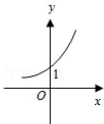
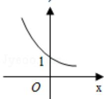
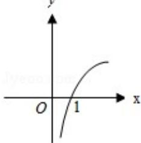
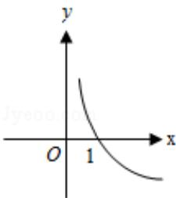

<!-- question-source:start -->
2. (5 分) (2010•四川) 函数 $y = \log_2 x$ 的图象大致是（）

A.

B.

C.

D.

<!-- question-source:end -->

![[高中/真题/按年份分类/2010/2010年四川高考文科数学试卷_word版_和答案/选择题/题目/answers/Q00024030A1.md]]
