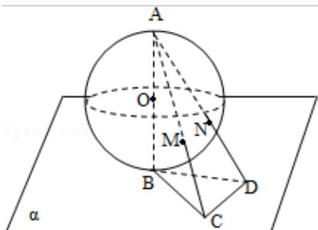

<!-- question-source:start -->
12.（5分）(2010·四川)半径为R的球O的直径AB垂直于平面 $\alpha$ ，垂足为B， $\triangle \mathrm{BCD}$ 是平面 $\alpha$ 内边长为R的正三角形，线段AC、AD分别与球面交于点M、N，那么M、N两点间的球面距离是（ ）

A. $\operatorname{Rarccos}\frac{17}{25}$ B. $\operatorname{Rarccos}\frac{18}{25}$ C. $\frac{1}{3}\pi R D$ . $\frac{4}{15}\pi R$

##
<!-- question-source:end -->

![[高中/真题/按年份分类/2010/2010年四川高考文科数学试卷_word版_和答案/选择题/题目/answers/Q00027971A1.md]]
