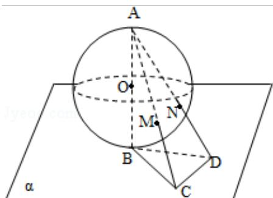

> [!faq]- 2010年四川高考文科数学试卷(word版)和答案解析
>
> > [!success]- **【答案】** 详见解析
>
> > [!note]- **【分析】**
> > 求解本题需要根据题意求解出题目中的角MON的余弦，再代入求解，即可求出MN的两点距离.
>
> > [!note]- **【解析】**
> > 分析】求解本题需要根据题意求解出题目中的角MON的余弦，再代入求解，即可求出MN的两点距离.
> >
> > 【
> > 解答】解：由已知，AB=2R，BC=R，
> >
> > 故 $\tan \angle BAC = \frac{1}{2}$
> >
> > $$
> > \cos \angle B A C = \frac {2 \sqrt {5}}{5}
> > $$
> >
> > 连接 OM，则△OAM 为等腰三角形
> >
> > $$
> > \mathrm{AM} = 2 \mathrm{AO} \cos \angle \mathrm{BAC} = \frac {4 \sqrt {5}}{5} \mathrm{R},
> > $$
> >
> > 同理 $AN = \frac{4\sqrt{5}}{5} R$ ，且MN||CD
> >
> > 而 $\mathrm{AC} = \sqrt{5}\mathrm{R}$ ， $\mathrm{CD} = \mathrm{R}$
> >
> > 故 MN: CD=AM: AC
> >
> > $$
> > \mathrm{MN} = \frac {4}{5} \mathrm{R},
> > $$
> >
> > 连接 OM、ON，有 OM=ON=R
> >
> > 于是 $\cos \angle MON = \frac{OM^2 + ON^2 - MN^2}{2OM \cdot ON} = \frac{17}{25}$
> >
> > 所以 M、N 两点间的球面距离是 $\text{Rarccos} \frac{17}{25}$ .
> >
> > 故选A.
> >
> > 
> >
> > 【点评】本题考查学生的空间想象能力，以及学生对球面上的点的距离求解，是中档题.
> >
> > ##
> > 二、填空题（共4小题，每小题4分，满分16分）
