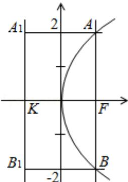

<!-- question-source:start -->
13.（5分）（2010·重庆）已知过抛物线 $y^{2} = 4x$ 的焦点F的直线交该抛物线于A、B两点， $|AF| = 2$ ，则 $|BF| =$ \_\_\_\_.

<!-- question-source:end -->

![[高中/真题/按年份分类/2010/2010年重庆市高考数学试卷_文科_含答案/填空题/题目/answers/Q00023002A1.md]]
