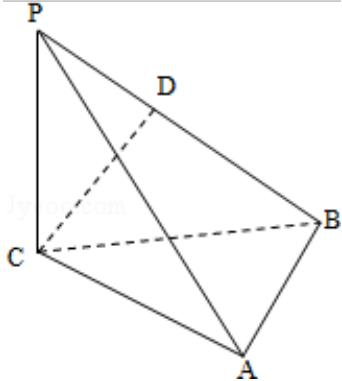

<!-- question-source:start -->
20. (12 分) (2010·重庆) 如图, 三棱锥 P - ABC 中, PC⊥平面 ABC, PC=AC=2, AB=BC, D 是 PB 上一点, 且 CD⊥平面 PAB.

(1) 求证: AB⊥平面 PCB;

(2) 求二面角 C - PA - B 的大小的余弦值.

<!-- question-source:end -->

![[高中/真题/按年份分类/2010/2010年重庆市高考数学试卷_文科_含答案/填空题/题目/answers/Q00023009A1.md]]
