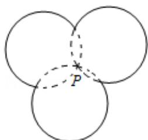

<!-- question-source:start -->
15.（5分）(2010·重庆)如图，图中的实线是由三段圆弧连接而成的一条封闭曲线C，各段弧所在的圆经过同一点P（点P不在C上）且半径相等．设第i段弧所对的圆心角为 $\alpha_{i}$ （i=1，2，3），则 $\cos\frac{\alpha_{1}}{3}\cos\frac{\alpha_{2}+\alpha_{3}}{3}-\sin\frac{\alpha_{1}}{3}\sin\frac{\alpha_{2}+\alpha_{3}}{3}=$ \_\_\_\_.

##
三、解答题（共6小题，满分75分）
<!-- question-source:end -->

![[高中/真题/按年份分类/2010/2010年重庆市高考数学试卷_文科_含答案/填空题/题目/answers/Q00027976A1.md]]
