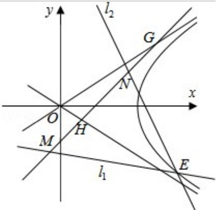

<!-- question-source:start -->
21. (12 分) (2010·重庆) 已知以原点 O 为中心, F ( $\sqrt{5}$ , 0) 为右焦点的双曲线 C 的离心率 $e=\frac{\sqrt{5}}{2}$ .

(1) 求双曲线 C 的标准方程及其渐近线方程;

(2) 如图, 已知过点 $M(x_1, y_1)$ 的直线 $l_1: x_1x + 4y_1y = 4$ 与过点 $N(x_2, y_2)$ (其中 $x_2 \neq x_1$ ) 的直线 $l_2: x_2x + 4y_2y = 4$ 的交点 E 在双曲线 C 上, 直线 MN 与两条渐近线分别交与 G、H 两点, 求 $\triangle OGH$ 的面积.

# 2010 年重庆市高考数学试卷（文科）

参考
<!-- question-source:end -->

![[高中/真题/按年份分类/2010/2010年重庆市高考数学试卷_文科_含答案/解答题/题目/answers/Q00023010A1.md]]
